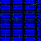

# ApplePicker
A computationally cheap Atari-style gym environment for a grid-world version of the travelling salesman problem  


<p align="center">

</p>

# Objective
The goal is for the agent to collect all the apples in as few steps a possible  

# Game versions
1. 'ApplePicker-v0' the agent start location and object locations are changed upon each episode i.e. when you call env.reset()  
2. 'ApplePickerDeterministic-v0' the agent and object locations are fixed for that particular enviroment instance

# Environment arguments
* **num_objects**: number of apples spawned after every reset (default 100)  
* **default_reward**: change the reward the agent receives after every step (default -0.1)


# Image space
produces a RGB numpy array of shape 84x84x3 for the default orchid map.  
* 1st or red channel represents the agent location.   
* 2nd or green channel represents the locations of the apples that need picking.  
* 3rd or blue channel represents environment blockers, aka tiles that the agent can't access. 

# Custom map  
1. Create your own numpy **floating** point RGB array, and have the 3rd channel value of 1.0 where you wan't a tile blocker to be,  
2. Save the numpy array into apple_picker/apple_picker/maps
3. Pass in the argument as following  
```python
env = gym.make('ApplePicker-v0', map_filepath='mymap.npy')
```
